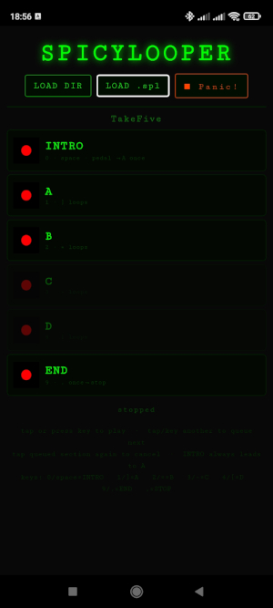

# SpicyLooper

A dark-themed audio loop player for Android, designed for musicians who want to practice over backing tracks. Load short phrases and play them in sequence — INTRO, looping sections A–D, and a final END phrase.



---

## Installation

SpicyLooper is distributed as an Android APK (side-load — not on the Play Store).

1. Copy `SpicyLooper-debug.apk` to your Android device.
2. On your device go to **Settings → Apps → Special app access → Install unknown apps** and allow your file manager or browser.
3. Open the APK file and tap **Install**.

---

## Loading a project

A project is a plain directory containing your audio files, named by section:

| File | Section |
|------|---------|
| `intro.mp3` / `.wav` | INTRO — plays once, then jumps to A |
| `a.mp3` / `.wav` | Section A |
| `b.mp3` / `.wav` | Section B |
| `c.mp3` / `.wav` | Section C |
| `d.mp3` / `.wav` | Section D |
| `end.mp3` / `.wav` | END — plays once, then stops |
| `cover.jpg` | Cover image (optional) |

Formats supported: `.mp3`, `.wav`, `.ogg`, `.m4a`, `.aac`

Not all sections are required — load only the ones you need.

### LOAD DIR

Tap **LOAD DIR** and select all the audio files in your project folder at once. The app identifies each section by file name.

> **Android note:** the system file picker does not support folder selection. Tap **LOAD DIR**, then select all audio files individually in one go (long-press to multi-select).

### LOAD .spl

Alternatively, package the directory into a `.spl` file (a ZIP renamed to `.spl`) using the included helper script:

```bash
./make_spl.sh TakeFive/   # → TakeFive.spl
```

Then tap **LOAD .spl** and pick the `.spl` file.

---

## Playback

```
INTRO → A (auto) → B / C / D (on demand) → END → stop
```

| Section | Behaviour |
|---------|-----------|
| INTRO | Plays once, then A starts automatically |
| A B C D | Loops forever until you queue another section |
| END | Plays once, then stops |

### Controls

- **Tap a section** — starts it immediately if nothing is playing; otherwise queues it as *next*
- **Tap a queued section again** — cancels the queue
- **■ Panic!** (top right) — stops everything immediately

When INTRO starts, A is automatically pre-queued as next. The current loop always finishes before switching to the next section.

### Status indicators

| Icon | Meaning |
|------|---------|
| `stop.gif` | Section loaded, not playing |
| `play.gif` | Currently playing |
| `next.gif` | Queued — will play when the current loop ends |

### Keyboard shortcuts (desktop / tablet with keyboard)

| Key | Action |
|-----|--------|
| `0` or `Space` | INTRO |
| `1` or `]` | A |
| `2` or `=` | B |
| `3` or `-` | C |
| `4` or `[` | D |
| `9` or `.` | END |
| `,` | Stop (Panic) |

---

## Bluetooth foot pedal (ESP32)

SpicyLooper includes firmware for an ESP32-based Bluetooth HID pedal (`pedal/pedal.ino`). The pedal pairs as a wireless keyboard and sends the key codes SpicyLooper listens to, so your hands stay on the instrument.

### Hardware

- **Board**: ESP32 Dev Module
- **Library**: HijelHID_BLEKeyboard 0.5.0 (Arduino)
- **Card**: esp32 3.3.10 by Espressif Systems

### Wiring

Connect each pedal switch between the pin and GND. The firmware uses internal pull-up resistors — no external resistors needed.

| GPIO pin | Key sent | Action |
|----------|----------|--------|
| 13 | `Space` | INTRO |
| 12 | `]` | A |
| 14 | `=` | B |
| 27 | `-` | C |
| 26 | `[` | D |
| 25 | `.` | END |
| 33 | `,` | Stop (Panic) |


### Flashing

1. Open `pedal/pedal.ino` in the Arduino IDE.
2. Select board **ESP32 Dev Module**.
3. Install library **HijelHID_BLEKeyboard 0.5.0**.
4. Flash via USB, then pair the device over Bluetooth — it appears as a keyboard.

---

## Building from source

Requires Docker only — nothing else needs to be installed on the host.

The build uses two Docker images to keep iteration fast:

### Step 1 — Build the builder image (once)

```bash
./build-builder.sh
```

Downloads Java 17, the Android SDK, Node packages, and pre-warms the Gradle cache. Takes ~15 minutes but only needs to be run once (or when `package.json` / `capacitor.config.json` change).

### Step 2 — Build the APK (every release)

```bash
./build-apk.sh
```

Copies the web assets into the builder image and runs Gradle with a warm cache. Fast.

Output: `output/SpicyLooper-debug.apk`

---

## Web version

Open `index.html` directly in any modern browser — no server needed for basic use. For the **LOAD DIR** feature to work correctly on desktop, use Chrome or Edge.
